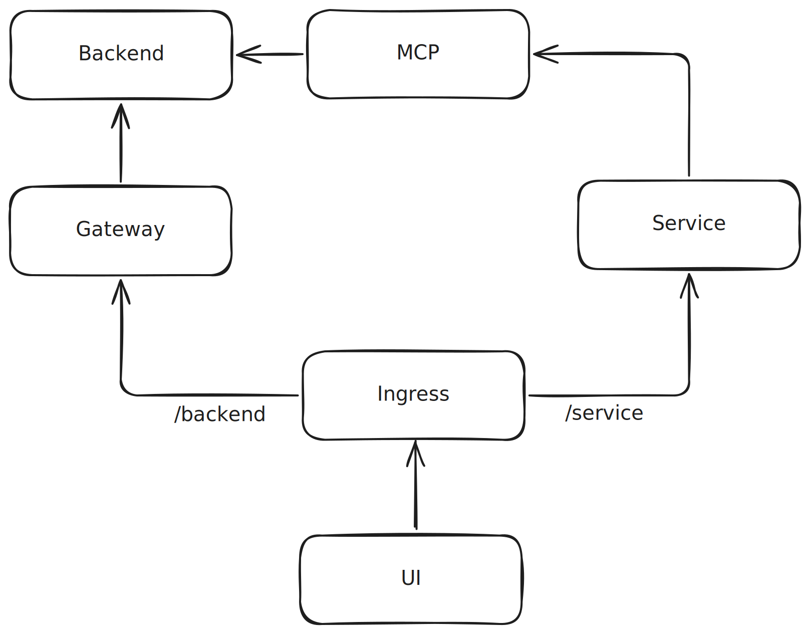

# queue

## TODO
 - Better MCP -> activity translation mechanism
 - Fix definition of get queue MCP tool (should not just return a string)
 - Auth for requests from the service via MCP to backend 
 - Conflict logic on backend i.e. don't allow something in the queue twice
 - Multi tenancy on backend (ensure updates don't interrupt one another)

## Architecture

## Services / Directories

### Backend

A Rust-based, gRPC service dedicated to managing the queue. Does it need to be in Rust? Absolutely not but it feels like a simple use-case and therefore a good chance to give it a go!

### Dev

This is a subdmodule pointing to resources I use for local development without having to run everything in containers.

### Gateway

The gateway fronts the backend service gRPC API with a UI friendly REST based implementation. 

### MCP

A Python service that stands up an interface enabling AI agents to use the backend queue service as a tool. Python was chosen as it seems to have a good ecosystem for MCP servers (e.g. FastMCP).

### Proto

A directory that hosts Proto files that can be used to generate server and client code for communication between the backend service and any clients.

### Service

A Python service dedicated to running AI agents for interacting with the backend service via the MCP service. Python was chosen because of the array of tools available including the OpenAI Agents SDK & compatibility with Temporal services.

### UI

A TypeScript, React & Vite based implementation consuming Tailwind for styling.

## Demo